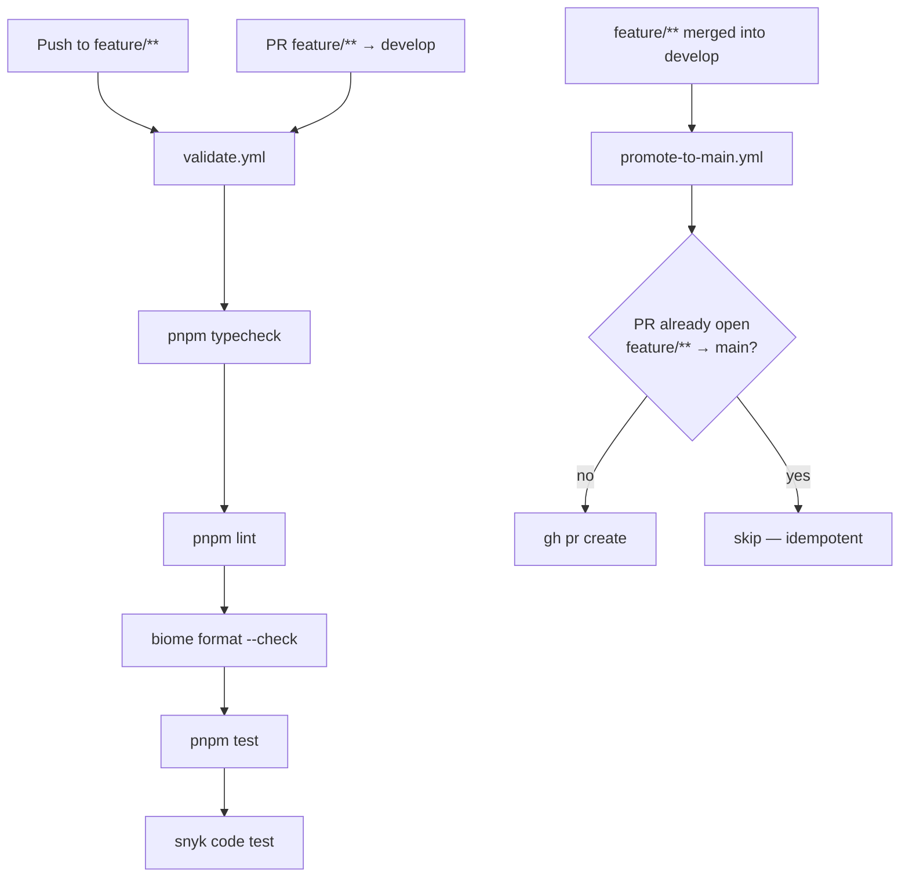

# CI/CD (M1.5) Design

**Spec**: `.specs/features/ci-cd/spec.md`
**Status**: PLANNED

> Architectural decisions that motivate this design are captured in `.specs/project/STATE.md` as AD-010.

---

## Architecture Overview

Two independent GitHub Actions workflows handle distinct concerns, keeping validation failure isolated from promotion logic.



---

## Workflow Contracts

### `validate.yml`

| Property | Value |
|---|---|
| **File** | `.github/workflows/validate.yml` |
| **Triggers** | `push` on `feature/**`; `pull_request` targeting `develop` from `feature/**` |
| **Concurrency** | `group: validate-${{ github.ref }}`, `cancel-in-progress: true` |
| **Runner** | `ubuntu-latest` |
| **Job name** | `validate` (this exact name is used as the required status check) |
| **Node version** | 22 LTS |
| **Package manager** | `pnpm` via `pnpm/action-setup@v4` + `pnpm-lock.yaml` cache |

**Steps (in order)**:

1. `actions/checkout@v4`
2. `pnpm/action-setup@v4` — reads `pnpm-workspace.yaml`; specify `version` matching the lock file
3. `actions/setup-node@v4` — `node-version: 22`, `cache: pnpm`
4. `pnpm install --frozen-lockfile`
5. `pnpm typecheck`
6. `pnpm lint`
7. `pnpm exec biome format --check .` — format check only (no writes); distinct from `pnpm format`
8. `pnpm test`
9. Snyk SAST — `snyk/actions/node@master`, `command: code test`, `args: --severity-threshold=high`, `env.SNYK_TOKEN: ${{ secrets.SNYK_TOKEN }}`

**Why two triggers**: the `push` trigger catches every commit early; the `pull_request` trigger ensures the check is visible on the PR itself so branch protection can require it.

**Why `--frozen-lockfile`**: prevents silent dependency drift between the lock file and `node_modules`.

**Why separate format check from `pnpm lint`**: `pnpm lint` runs `biome check` (lint rules only); `biome format --check` is the CI-safe no-write variant for format enforcement. Running both provides complete Biome coverage without conflating the two concerns.

---

### `promote-to-main.yml`

| Property | Value |
|---|---|
| **File** | `.github/workflows/promote-to-main.yml` |
| **Trigger** | `pull_request` with `types: [closed]`, `branches: [develop]` |
| **Job condition** | `github.event.pull_request.merged == true && startsWith(github.event.pull_request.head.ref, 'feature/')` |
| **Runner** | `ubuntu-latest` |
| **Job name** | `open-main-pr` |
| **Permissions** | `contents: read`, `pull-requests: write` |
| **Token** | `secrets.GITHUB_TOKEN` (default) |

**Steps (in order)**:

1. `actions/checkout@v4`
2. Idempotency pre-check via `gh pr list --base main --head <branch> --state open --json number --jq length`; skip if > 0
3. `gh pr create --base main --head <branch> --title "release: <original title>" --body "..."` (env: `GH_TOKEN: ${{ secrets.GITHUB_TOKEN }}`)

**Token note**: the default `GITHUB_TOKEN` opens the PR but cannot trigger further workflow runs on it (GitHub Actions security boundary). Contributors must push a commit to the promoted PR to trigger `validate.yml` on it, or re-run checks manually. If automatic re-validation of the promoted PR is required in the future, provision a PAT stored as `PROMOTION_TOKEN` and replace the token reference.

---

## File Layout

```
personal-blog/
├── .github/
│   └── workflows/
│       ├── validate.yml          # CI-1: feature-branch gate
│       └── promote-to-main.yml   # CI-2: develop→main auto-PR
├── .nvmrc                        # CI-3: pin Node 22 for local dev alignment
└── README.md                     # CI-4: CI/CD section added
```

No source files under `src/` are modified. No new npm scripts or dependencies are introduced. Workflows reuse existing `pnpm` scripts verbatim.

---

## Branch Protection Configuration (Manual Step)

After workflows are pushed, configure branch protection on `develop` in the GitHub UI:

**Settings → Branches → Branch protection rules → develop:**

- [x] Require status checks to pass before merging
  - Required check: `validate`
- [x] Require branches to be up to date before merging
- [ ] (Optional) Require linear history

**On `main`:**

- [x] Require status checks — only after the promoted PR is known to trigger `validate` (requires a PAT; defer until AD-010 revisited)

---

## Required Secrets

| Secret | Purpose | Status |
|---|---|---|
| `SNYK_TOKEN` | Snyk SAST authentication | ✅ provisioned |
| `GITHUB_TOKEN` | Auto-created by GitHub; used by `gh` CLI in promote workflow | ✅ always available |
