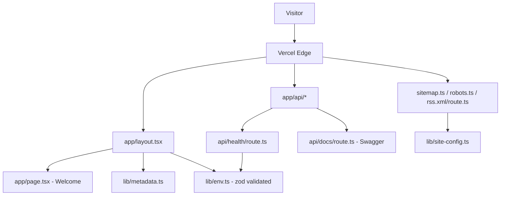

# Foundation (M1) Design

**Spec**: `.specs/features/foundation/spec.md`
**Status**: Draft

> Architectural decisions that justify this design are already captured in `.specs/project/STATE.md` as AD-001..AD-007. This document covers the concrete **layout and contracts** that realize those decisions.

---

## Architecture Overview

One Next.js 15 App Router application, deployed as Vercel serverless + edge. Routes are Server Components by default; Client Components are opt-in. All "infrastructure" concerns (env, SEO metadata, site config, env validation) live under `src/lib/` and are imported by route files. Tests colocate next to implementation.



---

## Folder Structure

```
personal-blog/
├── src/
│   ├── app/
│   │   ├── layout.tsx              # Root layout + metadata template
│   │   ├── page.tsx                # Welcome (P1)
│   │   ├── page.test.tsx           # RTL test for welcome
│   │   ├── not-found.tsx           # Minimal 404
│   │   ├── sitemap.ts              # FND-08
│   │   ├── sitemap.test.ts
│   │   ├── robots.ts               # FND-09
│   │   ├── robots.test.ts
│   │   ├── rss.xml/
│   │   │   ├── route.ts            # FND-10
│   │   │   └── route.test.ts
│   │   └── api/
│   │       ├── health/
│   │       │   ├── route.ts        # FND-07
│   │       │   └── route.test.ts
│   │       └── docs/
│   │           └── route.ts        # FND-14 Swagger JSON/UI
│   ├── components/
│   │   ├── ui/                     # shadcn primitives (generated)
│   │   └── layout/
│   │       ├── site-header.tsx
│   │       └── site-footer.tsx
│   └── lib/
│       ├── env.ts                  # FND-13 zod-validated env
│       ├── env.test.ts
│       ├── site-config.ts          # brand/site constants
│       ├── metadata.ts             # FND-11 SEO helpers
│       ├── metadata.test.ts
│       └── utils.ts                # shadcn cn()
├── test/
│   └── setup.ts                    # Vitest + RTL setup
├── public/
│   └── favicon.ico
├── biome.json
├── vitest.config.ts
├── tsconfig.json
├── next.config.ts                  # FND-12 security headers
├── tailwind.config.ts              # (or v4 CSS-only if we choose v4)
├── components.json                 # shadcn config
├── .env.example
├── package.json
└── README.md
```

**Colocation rule:** every non-trivial `.ts(x)` file has a sibling `.test.ts(x)`. Enforced by convention; a CI check scanning `src/` for missing test neighbors is a possible M1.5 add.

---

## Component & Module Contracts

### `src/lib/env.ts` — Environment validation (FND-13)

- **Purpose**: Validate and type environment variables at startup. Crash fast on misconfiguration.
- **Interface**:
  - `export const env: Env` — frozen, typed object of validated variables
  - `export type Env = z.infer<typeof envSchema>`
- **Dependencies**: `zod`
- **Reuses**: none (new)
- **Key behavior**: Parses `process.env` once at import time. Splits server-only vars from `NEXT_PUBLIC_*` vars. Server-only vars must not be imported from client components — enforced by naming convention and a Biome rule if feasible.

### `src/lib/site-config.ts` — Site constants

- **Purpose**: Single source of truth for brand name, URL, default locale, social handles, feed metadata.
- **Interface**: `export const siteConfig: SiteConfig`
- **Used by**: `lib/metadata.ts`, `app/sitemap.ts`, `app/robots.ts`, `app/rss.xml/route.ts`, `app/layout.tsx`.

### `src/lib/metadata.ts` — SEO helpers (FND-11)

- **Purpose**: Build Next.js `Metadata` objects consistently.
- **Interface**:
  - `buildRootMetadata(): Metadata` — title template, default description, OG/Twitter defaults
  - `buildPageMetadata(input: PageMetadataInput): Metadata` — per-page overrides
- **Dependencies**: `site-config.ts`, `next` types.

### `app/api/health/route.ts` — Healthcheck (FND-07)

- **Interface**: `export async function GET(): Promise<NextResponse<HealthPayload>>`
- **Shape**: `{ status: "ok"; uptime: number; version: string; timestamp: string }`
- **Headers**: `Cache-Control: no-store`
- **Dependencies**: `env` (for `APP_VERSION`), Node `process.uptime()`.

### `app/sitemap.ts` (FND-08)

- **Interface**: `export default function sitemap(): MetadataRoute.Sitemap`
- Uses Next.js App Router's file-based convention. Returns `[]` in M1; M3 will populate from Payload.

### `app/robots.ts` (FND-09)

- **Interface**: `export default function robots(): MetadataRoute.Robots`
- Allows all user agents, references sitemap URL from `siteConfig`.

### `app/rss.xml/route.ts` (FND-10)

- **Interface**: `export async function GET(): Promise<Response>`
- Serves RSS 2.0 XML with channel metadata from `siteConfig`, empty `<item>` list in M1.
- `Content-Type: application/rss+xml; charset=utf-8`.

### `app/api/docs/route.ts` (FND-14)

- **Interface**: serves the OpenAPI JSON. A separate `app/api/docs/ui/page.tsx` (or equivalent) may render Swagger UI.
- **Gating**: In production, return 404 unless `ENABLE_API_DOCS === "true"`.

### `next.config.ts` — Security headers (FND-12)

- Sets `headers()` returning CSP, HSTS, X-Content-Type-Options, Referrer-Policy, X-Frame-Options on all routes.
- CSP starts strict; will be relaxed for Payload admin / MDX as needed in M2/M3.

---

## Data Models

### Health response (FND-07)

```ts
interface HealthPayload {
  status: "ok"
  uptime: number          // seconds since process start
  version: string         // from env.APP_VERSION, fallback to "dev"
  timestamp: string       // ISO-8601
}
```

### Env schema (FND-13)

```ts
const envSchema = z.object({
  NODE_ENV: z.enum(["development", "test", "production"]),
  APP_VERSION: z.string().default("dev"),
  NEXT_PUBLIC_SITE_URL: z.string().url(),
  ENABLE_API_DOCS: z.enum(["true", "false"]).default("false"),
})
```

---

## Test Conventions (TDD — AD-006)

- **Runner**: Vitest with `environment: "jsdom"`, `globals: true`.
- **Matchers**: `@testing-library/jest-dom` extended via `test/setup.ts`.
- **React**: `@testing-library/react` + `@testing-library/user-event`.
- **Structure**: Every test uses AAA with explicit comment markers:

  ```ts
  import { describe, expect, it } from "vitest"
  import { render, screen } from "@testing-library/react"
  import Page from "./page"

  describe("WelcomePage", () => {
    it("renders the site name as H1", () => {
      // Arrange
      const sut = <Page />

      // Act
      render(sut)

      // Assert
      expect(
        screen.getByRole("heading", { level: 1, name: siteConfig.name }),
      ).toBeInTheDocument()
    })
  })
  ```

- **Coverage**: `pnpm test:coverage` uses v8 provider; thresholds configured in `vitest.config.ts`. M1 starts at 80% lines for `src/lib/` and `src/app/api/`, no threshold for pages.
- **TDD gate**: Each task below follows red → green → refactor. Tests are written and committed before or with their implementation — never after.

---

## Error Handling Strategy

| Scenario                          | Handling                                                 | User Impact                      |
| --------------------------------- | -------------------------------------------------------- | -------------------------------- |
| Missing env var at startup        | `env.ts` throws with zod error message                   | App fails to boot (desired)      |
| Unknown route                     | `app/not-found.tsx` renders with root metadata           | Minimal 404 page                 |
| `/api/health` unexpected throw    | Next.js default error boundary → 500                     | JSON error (generic)             |
| `/api/docs` in prod without flag  | Return 404                                               | Discoverable only when enabled   |
| CSP blocks a resource             | Browser console warning; app still renders               | Dev: fix CSP; prod: investigate  |

---

## Tech Decisions (non-obvious)

| Decision                         | Choice                                           | Rationale                                                                                        |
| -------------------------------- | ------------------------------------------------ | ------------------------------------------------------------------------------------------------ |
| Package manager                  | **pnpm**                                         | Fast, disk-efficient, workspace-ready (useful when Payload adds modules). Locks reproducibility. |
| Tailwind version                 | **Verify at T-UI-01**                            | Tailwind v4 ships via CSS; shadcn/ui compatibility must be confirmed via Context7 before picking. Fallback to v3 if v4 path is rough. |
| RSS generation                   | Hand-built XML string                            | KISS — one small module, no extra dependency. Switch to `feed` library if complexity grows.      |
| Swagger library                  | **Verify at T-SWAG-01**                          | `next-swagger-doc` is the common pick for App Router; confirm current status via Context7.       |
| `any` enforcement                | Biome `suspicious/noExplicitAny` = **error**     | Makes AD-007 automated, not cultural.                                                            |
| Env split                        | Two zod schemas (server + public)                | Prevents accidental server-var leak into client bundles.                                         |

---

## Research Flags (verify via Context7 at implementation time)

These flags exist because our knowledge may be stale; NEVER fabricate. Each is resolved inside the corresponding task before code is written.

- **RF-1**: Current Next.js LTS major + `create-next-app` default flags.
- **RF-2**: Vitest + Next.js App Router setup (which `vite-*` plugins are current).
- **RF-3**: shadcn/ui + Tailwind v4 official install path.
- **RF-4**: Biome recommended config for Next.js + React + TS (rule names, preset).
- **RF-5**: `next-swagger-doc` (or alternative) current support for App Router.

---

## Out-of-Scope Reminders

Everything already excluded in `spec.md` "Out of Scope". In particular: no auth, no Payload, no posts, no i18n, no MDX in M1.
